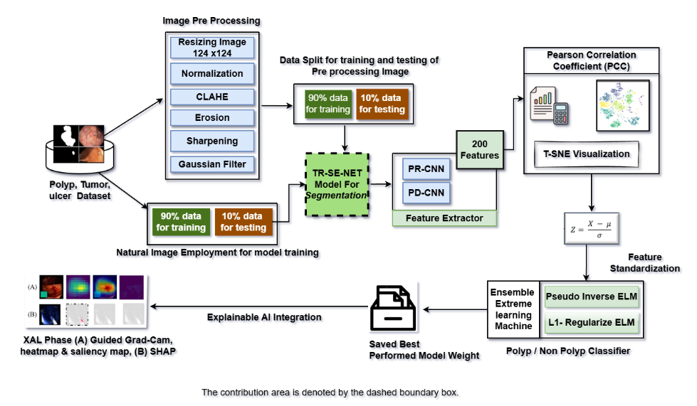

## Thesis Proposal: Deep learning based detection of colorectal polyps using TR-SE-NET and Ensimble ELM architecture with Explainable AI.

1. __Background and present state of the problem__ 

Colorectal cancer (CRC) remains one of the leading causes of cancer-related mortality worldwide, and early detection of colorectal polyps plays a crucial role in prevention and improved patient outcomes. Traditional colonoscopy, although widely used, relies heavily on manual visual inspection, making it susceptible to intra-observer variability, fatigue, and missed lesions. These challenges underline the necessity for accurate, automated, and interpretable computer-aided detection systems.
Recent advancements in deep learning have significantly contributed to addressing these limitations. Ensemble Extreme Learning Machines (ELM) integrated with Convolutional Neural Networks (CNNs) have shown improvements in detection performance and model interpretability [1]. Transformer-based architectures capture both local and global contextual features, enabling more robust feature extraction [2], while ensemble ELM approaches enhance classification reliability through multi-model aggregation [3]. SE modules have demonstrated the ability to emphasize channel-wise feature importance, boosting segmentation accuracy [4], and CNNs combined with SENet further refine polyp boundary detection [5]. Studies consistently report the drawbacks of manual colonoscopy, including variability among clinicians and frequent oversight of small or flat polyps [6].
Ensemble learning techniques continue to improve generalization and stability in diverse clinical environments [7]. Meanwhile, explainable AI (XAI) methods—such as heatmaps and saliency-based visualizations—offer greater transparency and support clinical trust in automated predictions [8]. Additional research reinforces the need for reliable automated systems to complement traditional colonoscopy, particularly in high-volume screening settings [9].
Together, these advancements address challenges of data scarcity, computational efficiency, and interpretability, moving toward reliable, automated, and explainable systems that support early CRC diagnosis and patient care.

2. __Justification of the study__  

The main goal of segmentation-based methods for polyp detection is to identify colorectal polyps in real time, which has not yet been adequately explored in research. Existing automated methods still struggles with segmentation precision, efficient feature extraction, and model generalization (M. F. Ahamed et al. [1]). Although CNN and transformer-based models have achieved progress, the application of the TR-SE-Net model for real-time segmentation-based polyp classification has not yet been explored. In this work, segmentation serves as the essential step to extract the most discriminative polyp features, which are then processed through a PD-CNN and Ensemble Extreme Learning Machine (EELM) architecture to achieve improved classification accuracy and robustness. The integration of TR-SE-Net with PD-CNN and EELM enhances both real-time detection and interpretability. Additionally, Explainable AI (XAI) techniques are incorporated to ensure model transparency and clinical reliability, supporting gastroenterologists with accurate and trustworthy automated polyp detection systems.

3. __Objectives with specific aims__  

This study proposes a deep learning–based system for automated colorectal polyp detection using TR-SE-Net integrated with PD-CNN and ensemble Extreme Learning Machine (ELM) architecture. The main objectives are:
To develop an efficient real-time segmentation-based preprocessing and feature extraction pipeline using the TR-SE-Net model for accurate and discriminative polyp feature representation.
To design and implement a TR-SE-Net-PD-CNN–Ensemble ELM (EELM) framework that seamlessly integrates deep learning and ensemble learning methodologies to enhance the accuracy, robustness, and interpretability of real-time colorectal polyp classification.
To incorporate Explainable AI (XAI) techniques to provide transparent and interpretable explanations for detection and classification decisions, fostering clinical trust.

4. __Outline of Methodology/ Experimental Design__  

An overview of the proposed methodology is shown in Fig. 1. This study aims to develop an automated colorectal disease detection system capable of performing both segmentation and classification for polyps, tumors, and ulcers by integrating TR-SE-Net with an Ensemble Extreme Learning Machine (EELM) framework enhanced through Explainable AI (XAI) techniques. The proposed TR-SE-Net–based segmentation model represents a key contribution of this research, specifically designed to achieve accurate and efficient lesion segmentation in real-time medical imaging applications.

Segmented colonoscopy image datasets containing polyp, tumor, and ulcer samples—such as Kvasir [10]—are utilized for supervised learning. All images undergo preprocessing operations, including resizing, intensity normalization, histogram equalization, and gaussian filter, to standardize input data and improve feature extraction accuracy. Both preprocessed and raw images are then fed into the proposed TR-SE-Net model for precise segmentation. TR-SE-Net employs a hybrid encoder–decoder structure that combines Transformer encoder blocks with Squeeze-and-Excite (SE) modules to enhance channel-wise attention and improve segmentation precision. Skip connections are applied to preserve spatial information between encoder and decoder layers, while ground-truth masks guide optimization using Dice score and Intersection over Union (IoU) metrics.
After segmentation, the extracted feature maps are forwarded to PD-CNN and PR-CNN models for deep feature extraction, producing 200 significant features that represent the most discriminative characteristics of each class. 
These features are further analyzed using the Pearson Correlation Coefficient (PCC) to evaluate inter-feature relationships and t-Distributed Stochastic Neighbor Embedding (t-SNE) for visualizing feature separability in reduced-dimensional space. Feature Standardization is then applied to normalize the extracted features for optimal learning performance.
The standardized features are processed by an Ensemble Extreme Learning Machine (EELM) architecture consisting of Pseudo-Inverse ELM and L1-Regularized ELM classifiers. This hybrid ensemble approach enhances model robustness, reduces overfitting, and improves classification accuracy across polyp, tumor, and ulcer categories. Each classifier independently contributes to the decision process, and their aggregated output enhances generalization and reliability [3].
Finally, to ensure clinical interpretability, XAI techniques such as Heatmaps, Saliency Maps, SHAP, and Guided Grad-CAM are incorporated to highlight the most influential image regions affecting classification decisions. The complete pipeline is evaluated using accuracy, sensitivity, specificity, F1-score, and inference time, ensuring a reliable, interpretable, and clinically applicable real-time system for gastrointestinal disease diagnosis.

5. __Expected outcomes__  

In this work, we aim to propose an effective deep learning approach for colorectal polyp detection and classification integrating TR-SE-Net with ensemble ELM and explainable AI. So, expected outcomes include:
 High-accuracy models for colorectal polyp detection with segmentation and classification capabilities.
Models with enhanced robustness and generalization capacity to perform reliably across diverse patient datasets and clinical scenarios.
Explainable AI-driven transparent visualizations of decision-making processes to build clinical trust and improve usability in medical practice.
These outcomes collectively aim to improve early diagnosis accuracy, reduce false positives /negatives, and advance automated medical imaging for gastrointestinal disease diagnosis.

6. __References:__   
[1] M. F. Ahamed, M. Nahiduzzaman, M. R. Islam, et al., “Detection of various gastrointestinal tract diseases through a deep learning method with ensemble ELM and explainable AI,” Expert Systems with Applications, vol. 256, p. 124908, Dec. 2024.  
[2] S. Kumar, et al., “Real-time colorectal polyp detection with transformer-based deep learning architectures,” Scientific Reports, vol. 14, 2024.  
[3] M. F. Ahamed, M. R. Islam, M. Nahiduzzaman, M. J. Karim, M. A. Ayari, and A. Khandakar, “Automated Detection of Colorectal Polyp Utilizing Deep Learning Methods with Explainable AI,” IEEE Access, vol. 12, 2024.  
[4] L. Zhou, et al., “Interpretability of deep learning models in colonoscopy analysis,” IEEE Transactions on Medical Imaging, vol. 43, no. 1, 2024.  
[5] J. Smith, L. Zhou, R. Wang, and T. Chen, “Automated colorectal polyp detection combining CNN and SE-Net,” Medical Image Analysis, vol. 78, 2023.  
[6] Y. Zhang, Y. Li, Z. Wang, et al., “Deep learning driven colorectal lesion detection in colonoscopy: A systematic review,” International Journal of Molecular Sciences, vol. 24, no. 5, 2023.  
[7] J. Lee, S. Kim, et al., “Ensemble Learning with Extreme Learning Machines for Colorectal Polyp Classification,” Neural Computing and Applications, vol. 35, no. 7, 2023.  
[8] H. Wu, et al., “Explainable AI for medical imaging: Applications in colorectal polyp detection,” Frontiers in Medicine, vol. 9, 2022.  
[9] G. Bernal, F. Sánchez, et al., “Comparative assessment of polyp detection methods in colonoscopy videos,” IEEE Journal of Biomedical and Health Informatics, vol. 23, no. 2, 2019.  
[10] M. Nagadia, “Kvasir dataset,” Kaggle, 2021. [Online]. Available: https://www.kaggle.com/datasets/meetnagadia/kvasir-dataset. [Accessed: 3-May-2025].  

7. Datasets Link:  
	7.1. Kvasir SEG Data set Masking for Polyp: https://datasets.simula.no/kvasir-seg/?utm_source=chatgpt.com  
	7.2  hyper-kvasir-segmentation https://datasets.simula.no/downloads/hyper-kvasir/hyper-kvasir-segmented-images.zip
	7.3  From Kaggle with Polyp annoted images: https://www.kaggle.com/datasets/debeshjha1/kvasirseg
	7.4  DigestPath Dataset https://www.kaggle.com/datasets/mittalswathi/digestpath-dataset
	7.5 Cancer cell dataset https://www.kaggle.com/datasets/andrewmvd/cancer-inst-segmentation-and-classification/data

	7.6 https://gemini.google.com/app/2077afabd9cd250d

